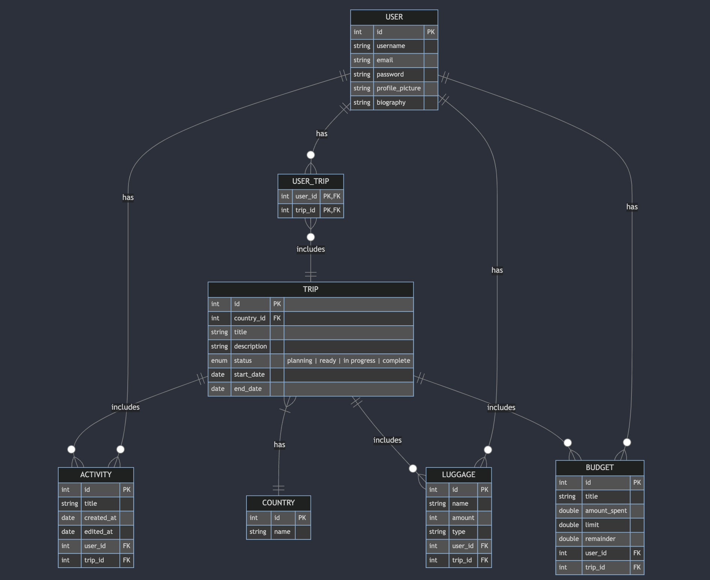
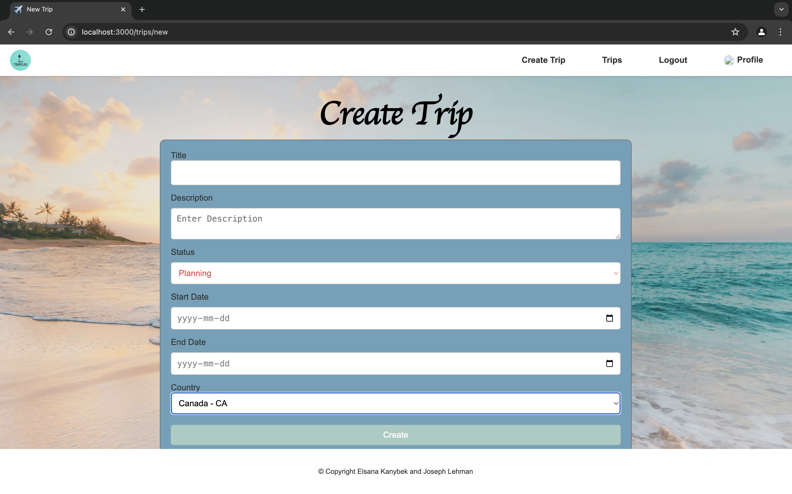

# Traveloo

> By [Elsana Kanybek](https://github.com/elkanybek) and [Joseph Lehman](https://github.com/joeyl83)
>> Web Programming II Final Project- Winter 2024

Go to demo: [Webpage Demo](#webpage-demonstration) (click here)

- [Overview](#️overview)
- [Core Functionality](#core-functionality)
- [Requirements](#requirements)
- [Entity Relationships](#️entity-relationships)
- [API Routes](#api-routes)
- [Webpage Demo](#webpage-demonstration)
- [Tools](#️tools)

## ✈️Overview

Introducing "Traveloo" – a comprehensive trip tracking platform for  explorers. Traveloo is designed for:

- Individuals planning trips to different countries and cities.
- Travel enthusiasts looking to organize and document their journeys.
- Users can add activities to a trip.
- Users can plan their luggage items.
- Users can manage their budget for a specific trip.

With Traveloo, users can plan and track their travel experiences.

## 🎀Core Functionality
1. **User Management**
   - Registration: Users can create accounts for session management.
   - Login/Logout: Secure authentication system for sessions.

2. **Trip Management**
   - Create Trip: Users can create new trips with details such as destination country, title, description, start and end date.
   - View Trip Details: Access trip details including cities to visit, activities planned, and trip duration.
   - Modify the status of a trip (Planning, Ready, In Progress, Complete)

3. **Activity Management**
   - Plan Activities: Users can add activities within their trip.
   
4. **Luggage Management**
   - Manage Luggage: Users can create, view and delete their packing items for each trip.

5. **Budget Management**
   - Manage Budget: Users can set, track, and manage their trip expenses.

## 📝Requirements 
### User Management Stories
  - As a user, I want to create an account to manage my trips and activities.
  - As a user, I want to log in to an account to access my planned trips.
  - As a user, I want to log out of my account to securely end my session.

### Trip Stories
  - As a user, I want to create a new trip to plan my travel.
  - As a user, I want to view details of a trip including cities to visit and duration.
  - As a user, I want to view a list of all of my trips.
  - As a user, I want to modify the details of an existing trip.
  - As a user, I want to delete an existing trip.
  - As a user, I want to modify the status of an existing trip.

### Activities Stories
  - As a user, I want to add an activity within a trip.
  - As a user, I want to delete an existing activity.
  - As a user, I want to view a list of all activities when viewing a trip.

### Luggage Stories
  - As a user, I want to add items to my luggage for a trip.
  - As a user, I want to delete items from my luggage.
  - As a user, I want to view a list of all items in my luggage for a trip.

### Budget Stories
  - As a user, I want to set a budget for each trip.
  - As a user, I want to view a summary of expenses for each trip.
  - As a user, I want to receive warning if I exceed my budget for a trip.

 
## 🖇️Entity Relationships

- **Authentication System:** Handling user registration, login, logout, and session management.
- **Trip Management:** Logic for trip creation and CRUD operations on trips.

## 📍API Routes

> ### Auth Management
| Request              | Action                           | Response              | Description                                                             |
| -------------------- | -------------------------------- | --------------------- | ----------------------------------------------------------------------- |
| GET /register        | UserController::getRegistrationForm | 200 RegisterFormView  | Gets the form to create a new user account.                             |
| GET /login           | AuthController::getLoginForm     | 200 LoginFormView     | Gets the form to login to our web page.                                 |
| POST /login          | AuthController::login            | 201 /trips            | User login and authentication.                                          |
| GET /logout          | AuthController::logout           | 200 /                 | Logout and end user session.    
| POST /login          | AuthController::login           | 400 Bad Request                 | Invalid credentials.                                          |

> ### User Management

| Request                                   | Action                     | Response                 | Description                                             |
| ----------------------------------------- | -------------------------- | ------------------------ | --------------------------------------------------------|
| POST /users                               | UserController::createUser | 201 /login               | Creates a new user in the database.                     |
| GET /users/:id                            | UserController::getUser    | 200 ShowUserView         | Shows the user profile.                                 |
| GET /users/:id/edit                       | UserController::getUpdateUserForm | 200 UpdateUserFormView| Gets the form to modify the information of a user       |
| PUT /users/:id/edit                            | UserController::updateUser | 200 /user/:id/edit         | Updates the current user informations in the database.  |
| POST /users                               | UserController::createUser | 400 Bad Request               | Bad request due to invalid creation data for user.                      |
| GET /users/:id                            | UserController::getUser    | 403 Forbidden         | Access to a user profile is forbidden.                         |
| PUT /users/:id                            | UserController::updateUser | 403 Forbidden           | Access to update another user profile is forbidden..  |

> ### Trip Management

| Request                                   | Action                     | Response                 | Description                                               |
| ----------------------------------------- | -------------------------- | ------------------------ | ----------------------------------------------------------|
| GET /trips                                | TripController::getAllTrips| 200 ListAllTrips              | Gets all the planned trips for the user.                  |
| GET /trips/new                            | TripController::getNewTripForm | 200 NewTripFormView  | Gets the form to the user to select the new trip location.|
| POST /trips                               | TripController::createTrip | 201 /trips/:id           | Create a new trip for the user.                           |
| GET /trips/:id/edit                       | TripController::getEditTripForm | 200 EditTripFormView| Gets the form to edit an existing trip.                   |
| GET /trips/:id                            | TripController::getTrip    | 200 ShowTripView         | Gets the information of a specific planned trip.         |
| PUT /trips/:id                            | TripController::updateTrip | 200 /trips/:id           | Updates the current trip information in the database.     |                            |
| DELETE /trips/:id                         | TripController::deleteTrip | 200 /trips               | Deletes the trip from the database.                       |
| POST /trips                               | TripController::createTrip | 400 Bad Request           | Invalid trip creation request.                        |
| PUT /trips/:id                            | TripController::updateTrip | 403 Forbidden          | Updates other user's trip data is forbidden.    |
| DELETE /trips/:id                         | TripController::deleteTrip | 403 Forbidden               | Deleting other usere's trip is forbidden.                  |

> ### Activity Management

| Request                                   | Action                             | Response                      | Description                            |
| ----------------------------------------- | ---------------------------------- | ----------------------------- | ---------------------------------------|
| GET /trips/:id/activities            | ActivityController::getAllActivities    | 200 ListAllActivitiesView          | Gets all the activities of a trip.       |
| POST /trips/:id/activities                | ActivityController::createActivity | 201 /trips/:id                | Adds an activity to a trip.            |
| DELETE /trips/:id/activities/:activityId          | ActivityController::deleteActivity | 200 /trips/:id                | Deletes the activity from the database.|
| DELETE /trips/:id/activities/:activityId         | ActivityController::deleteActivity | 403 Forbidden                 | Deleting other user's trip activities is forbidden.|

> ### Luggage Management

| Request                                   | Action                             | Response                      | Description                            |
| ----------------------------------------- | ---------------------------------- | ----------------------------- | ---------------------------------------|
| GET /trips/:id/luggage                    | LuggageController::getLuggageItems      | 200 ListAllLuggageView           | Retrieves all items in the user's luggage for a specific trip. |
| POST /trips/:id/luggage                   | LuggageController::addItemToLuggage| 201 /trips/:id/luggage        | Adds an item to the user's luggage. |
| DELETE /trips/:id/luggage/:itemId        | LuggageController::deleteLuggageItem| 200 /trips/:id/luggage        | Deletes an item from the user's luggage. |
| POST /trips/:id/luggage                   | LuggageController::addItemToLuggage| 400 Bad Request        | Invalid addition of the item to the luggage. |
| DELETE /trips/:id/luggage/:itemId        | LuggageController::deleteLuggageItem| 403 Forbidden        | Deleting another user's items is forbidden. |

> ### Budget Management

| Request                                   | Action                             | Response                      | Description                            |
| ----------------------------------------- | ---------------------------------- | ----------------------------- | ---------------------------------------|
| GET /trips/:id/budget                     | BudgetController::getAllBudgets        | 200 ListAllBudgetView            | Retrieves all the expenses/budget details for a specific trip. |
| POST /trips/:id/budget                    | BudgetController::addBudget        | 201 /trips/:id/budget         | Adds a budget to a trip. |
| DELETE /trips/:id/budget/:budgetId        | BudgetController::deleteBudget| 200 /trips/:id/budget/:budgetId        | Deleting a budget from the trip. |
| POST /trips/:id/budget                    | BudgetController::addBudget        | 400 Bad Request         | Invalid addition of a budget to a trip. |

## ✨Webpage Demonstration

#### **Homepage:**
 
> The homepage view with the initial screen that is displayed when a user visits the website for the first time. There is a background image and a simple menu where the user can choose to login or register.

#### **Registration:**

> The initial screen where a user can input the details of a new account to register. The page contains form fields for the username, email, password and confirm password, as well as a button to register.

#### **Login:**

> The page where a user can input the details of their account in order to login and access the trips that they created previously. The page consists of a form field for the username and password, and a login button.

#### **All Trips:**

> All of the user's trips for the logged in user to view. The user can click on the trip to get redirected to a page with more details.

#### **Create Trip:**

> This view is the form where the user can create a new trip. The page consists of a form field for the title, description, status of the trip, start date, end date and the country, and a create button.

#### **Trip View:**

> The page with all of the details on a trip. The country, description, start and end date is displayed. There is an option to add activities, luggages and budget to the specific trip. The user can also edit and/or delete the trip.

#### **Activities:**

> The page displays the user's activities for their specific trip. It provides options to add and remove activities.

#### **Luggage:**

> The page displays the user's luggage items for their trip. It provides options to add and remove luggage items. 

#### **Budget**

> This page shows the budget details for a particular trip, including planned expenses and actual spending. Users can track their expenses, add new expenses. It provides a comprehensive overview of their finances.

#### **Edit User:**

> This view is the form where the user can edit the details of their account. When the page is loaded, the form fields will be filled with the user's current information that the user can edit. Additionally, there is an option to add a profile picture so that the user can customize their account.

## ⚒️Tools
The backend is built with Node.js and TypeScript, following the Models-Controllers-Views architecture to maintain a clean and organized codebase. For data storage, PostgreSQL is used alongside an object-relational mapping (ORM) tool to streamline database interactions. Docker is employed for containerization, ensuring consistent environments across different stages of development and deployment. The application handles HTTP requests, manages sessions and cookies, and employs templating for dynamic content rendering. Routing and promises are utilized to manage asynchronous operations and ensure smooth user experiences.